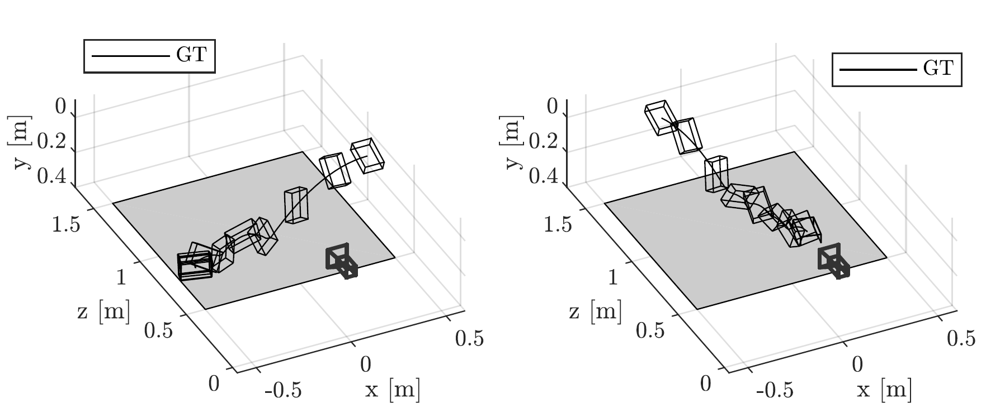
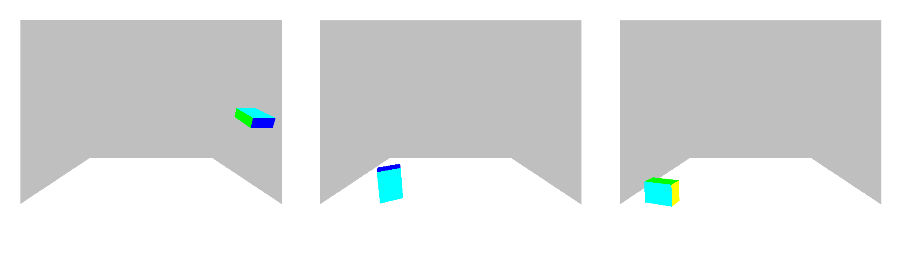
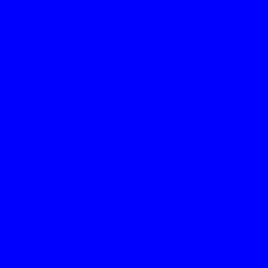
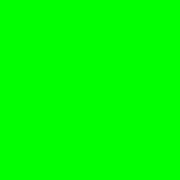
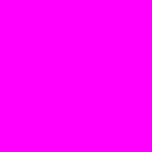
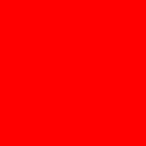
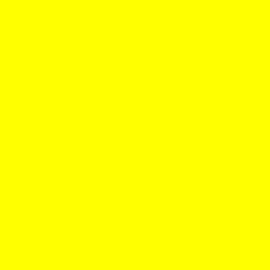
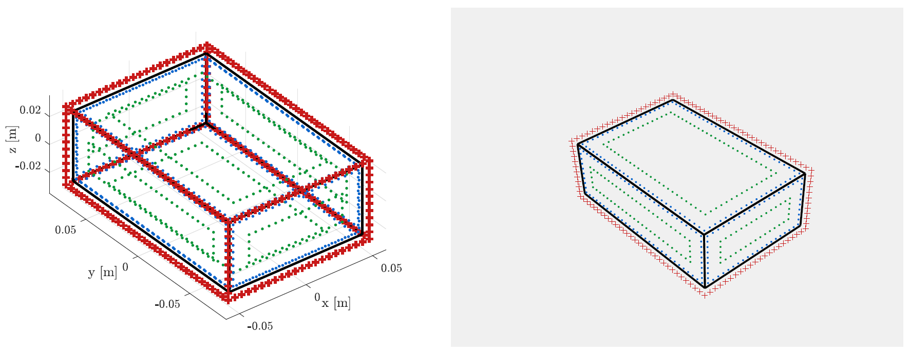

<h1 align="center">
Model-Based 6D Visual Object Tracking with Impact Collision Models
</h1>
<div align="center">
<h3>
<a href="https://research.tue.nl/en/persons/maarten-jongeneel">Maarten Jongeneel</a>,
<a href="http://users.isr.ist.utl.pt/~alex/pmwiki/index.php">Alexandre Bernardino</a>,
<a href="https://www.tue.nl/en/research/researchers/nathan-van-de-wouw/">Nathan van de Wouw</a>,
<a href="https://www.tue.nl/en/research/researchers/alessandro-saccon/">Alessandro Saccon</a>
<br>
<br>
ACC: American Control Conference, 2022
<br>
<br>
<a href="https://hal.archives-ouvertes.fr/hal-03170257">[Early Paper on HAL]</a>
</h3>
</div>


Introduction
============

The content of this repository is associated to the paper "Model-Based 6D Visual Object Tracking with Impact Collision Models". The objective for this project was to create an object tracking algorithm that is able to track rigid objects that make inpact with a surface, in particular focussing on logistics applications where boxes are being tossed on a surface. We show that conventional methods (Particle Filters (PF) with a Constant Velocity (CV) model) lose track of the box, as they cannot cope with the rapid changes in velocity imposed by impacts resulting from collisions between the box and the surface. We model the nonsmooth effects of impacts and friction in a motion model, and consider the state of the box to evolve in a Lie group. We present an object tracking algorithm, based on an Unscented Particle Filter, for systems whose state lives in a Lie group and incorporate this motion model. This results in the Geometric Unscented Particle Filter (GUPF) with a Nonsmooth (NS) motion model. We then track the 6D pose of the box by using its 2D projection onto synthetic images of a single RGB camera. 


Table of content
================
- [Overview](#overview)
- [Installation](#Installation)
- [Usage of the scripts](#Usage-of-the-scripts)
- [Contact](#Contact)

# Overview
There are two scenarios considered of a box being tossed on a platform, see the picture below. Both trajectories contain 65 poses (position/orientations) of the box, but the figures below show only the 1st and every 5th state of these trajectories. Note that in the first trajectory the motion of the object is parallel to the camera image, while in the second trajectory the object is moving towards the camera.




This ground truth data of these trajecotires is stored in two different folders under ``static``. The data in these folders contains **reference images** of the box surfaces (distinct colors for each face), the **test-data** (synthetic RGB images), the **box model** (geometric model, containing mass/inertia properties), the **ground truth data** (position/orientation data), and the **camera intrinsic matrix**. 

<p>&nbsp;</p>

### **Test-data**
In the figure below, one can see a few examples of the **test-data**, which are the syntetic images used as input for the algorithms. In this specific case, we see the 1st, 30th and 65th frame of the first trajectory (as shown in the left image in the figure above). 



<p>&nbsp;</p>

### **Reference-images**
The object has six distinct collors, for each face one. Reference color-histograms are computed from the images below. This allows to track the orientation of the box, as in the *likelihood function* similarities are computed for each individual face (see Section IV-A of the paper).

<div style = "display: flex;">
<div sytle = "flex: 16.3%;">
 </div>
<div sytle = "flex: 16.3%;">
 </div>
<div sytle = "flex: 16.3%;">
</div>
<div sytle = "flex: 16.3%;">
</div>
<div sytle = "flex: 16.3%;">
</div>
<div sytle = "flex: 16.3%;">
</div>
</div>

<p>&nbsp;</p>

### **Box-model**
The box model is defined in the script ``create_box_model.m``, where one is able to set the dimensions of the box. The colored points (indicated in red, green, and blue) are used to compute the color histograms. In the image below, one can see the points used to compute the different color histograms (Paper section IV-A), where on the left one can see the 3D model, and on the right one can see the representation of the object in the image plane for a given position/orientation. 



Furthermore, the ``Functions`` folder contains all the functions needed to run the four abovementioned scripts. The ``Results`` folder is used to store the simulation results.


# Installation
The code of this repository is all written in MATLAB and can directly be pulled from this repository. 

# Usage of the scripts
This repository contains four main scripts:

* ``GUPF_CV.m``
* ``CUPF_NS.m``
* ``PF_CV.m``
* ``PF_NS.m``

Each of these scripts corresponds to a different type of algorithm. The abbreviation before the underscore refers to the type of filter, either a **Particle Filter (PF)** or a **Geometric Unscented Particle Filter (GUPF)**. The abbreviation after the underscore refers to the type of motion model that is used within the filter, either a **Constant Velocity (CV)** motion model, or a **Nonsmooth (NS)** motion model. Using these scripts, it is possible to compare the effect of different motion models, while keeping the filtering technique the same, or the other way around.

In each of the above mentioned scripts contains one can change the following settings:
* Number of particles, set by ``Npart``
* To which frame you want to run the simulation, set by ``maxt``
* Boolean deciding if you want to save the results to the ``Results`` folder, set by ``DoSave``. 

See also an example below:

```matlab
Npart    = 500;     %Number of particles used   [-]
maxt     = 65;      %Run to this frame          [-]
DoSave   = true;    %Decide if you want to save 
```
Furthermore, one can set the *process noise covariance* and *measurement noise covariance*, given as
```matlab
%Process noise covariance and measurement noise covariance
Qv = 1e-6*diag([5 5 50 1 1 1 10 10 10 100 100 500]); %[mm]  Process noise covariance
Rv = 1e-4*diag([10 10 10 1 1 1]);                    %[mm]  Measurement noise covariance

```
In the scripts that use the **GUPF**, one can also change scaling parameters of the Unscented Kalman filter:
```matlab
alpha    = 0.9;      %UKF : point scaling parameter
beta     = 1;        %UKF : scaling parameter for higher order terms of Taylor series expansion
kappa    = 0.5;      %UKF : sigma point selection scaling parameter 
```

Note that the two scenarios that are considered contain a box with a particular size, mass, inertia, face colors, and initial state. The settings in each of the scripts are set to match these parameters, as the assumption is made that for each of the tracking algorithms, these parameters are known. 

# Contact
In case you have questions or if you encountered an error, please contact us through the "Issues" functionallity on GIT. 


